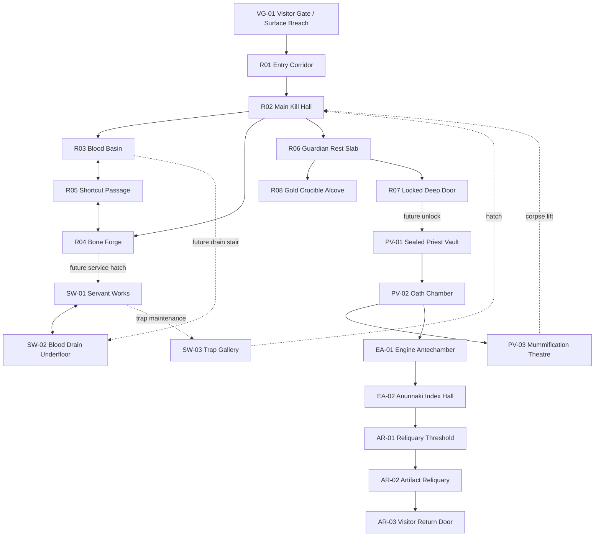

# VISITORS — Tomb Blueprint Master v0

## Purpose

This document turns the tomb into an engineer-readable map spec.

It has two jobs:

1. Define the **Test Tomb** as a buildable first slice for Codex.
2. Preserve the larger interconnected dungeon architecture so later expansions already have spatial logic.

The final tomb should feel like a sacred prison-machine: a place the Guardian knows intimately, where shortcuts, descents, chambers, traps, and corpse-drag routes all matter.

---

# 1. Global map model

## Coordinate standard

Use a simple 3D grid.

- X = east/west
- Z = north/south
- Y = vertical height
- 1 unit = 1 meter
- Player height target: 1.7–1.9 units
- Corridor width minimum: 3.0 units
- Main corpse-drag corridor width minimum: 4.0 units
- Doorway width minimum: 2.4 units; preferred mobile width: 3.0 units
- Stair width minimum: 3.0 units
- Rooms used for turning, dragging, and fighting should be generous because this is mobile portrait first-person.

## Vertical floors

| Floor ID | Name | Y level | Purpose |
|---|---:|---:|---|
| F0 | Surface Breach / Visitor Gate | 0 | Visitor entry, outer desecration zone |
| B1 | Test Tomb / Processing Ring | -6 | First playable core loop |
| B2 | Servant Works / Trap Underfloor | -12 | Servants, trap reset, corpse logistics |
| B3 | Sealed Priest Vault | -18 | Guardian origin, stronger rituals |
| B4 | Visitor Engine Antechamber | -26 | Alien/Anunnaki architecture begins |
| B5 | Artifact Reliquary | -34 | Final protected core |

First Codex build: implement only F0 entry stub and B1 Test Tomb. Leave sealed doors, hatches, or blocked stairs to future floors.

---

# 2. Interconnectedness flow map



## Reading the flow

- Visitors enter from F0 and descend into B1.
- R02 is the first true combat hub.
- R03, R04, and R08 are physical corpse-processing branches.
- R05 is the first shortcut loop.
- R07 is the first promise of deeper architecture.
- Future floors connect back upward through corpse lifts, service hatches, drain shafts, and trap galleries.

---

# 3. Contractor-style area schedule

## F0 — Surface Breach / Visitor Gate

| ID | Room | Size W×D×H | Connections | Build phase | Function |
|---|---:|---:|---|---|---|
| VG-01 | Visitor Gate | 8×10×5 | R01 | v0 stub | Spawn zone for visitors |
| VG-02 | Broken Outer Steps | 5×12×4 | VG-01 | Future | Approach drama |
| VG-03 | Desecrated Offering Niche | 4×4×3 | VG-01 | Future | Evidence of plunder |

## B1 — Test Tomb / Processing Ring

| ID | Room | Size W×D×H | Connections | Build phase | Function |
|---|---:|---:|---|---|---|
| R01 | Entry Corridor | 4×14×3.5 | VG-01, R02 | v0 | Visitor approach |
| R02 | Main Kill Hall | 10×12×4 | R01, R03, R04, R05, R06 | v0 | Central combat room |
| R03 | Blood Basin | 7×8×4 | R02, R05 | v0 | Drain corpses for blood |
| R04 | Bone Forge | 7×8×4 | R02, R05 | v0 | Extract bones for upgrades |
| R05 | Shortcut Passage | 4×12×3 | R03, R04 | v0 | First loop route |
| R06 | Guardian Rest Slab | 8×8×4 | R02, R07, R08 | v0 | Player start / between-wave chamber |
| R07 | Locked Deep Door | 5×4×5 | R06, PV-01 future | v0 locked | Endpoint / future descent |
| R08 | Gold Crucible Alcove | 6×6×4 | R06 | v0 | Melt gold for mechanism unlocks |

## B2 — Servant Works / Trap Underfloor

| ID | Room | Size W×D×H | Connections | Build phase | Function |
|---|---:|---:|---|---|---|
| SW-01 | Servant Works | 10×10×3.5 | R04 hatch, SW-02 | Future | Create/repair weak servants |
| SW-02 | Blood Drain Underfloor | 8×12×3 | R03 drain stair, SW-01 | Future | Shows where drained blood goes |
| SW-03 | Trap Counterweight Gallery | 6×14×4 | SW-01, R02 hatch | Future | Physical trap reset room |
| SW-04 | Corpse Lift Well | 5×5×12 vertical | R02, PV-03 | Future | Moves heavy corpses between floors |

## B3 — Sealed Priest Vault

| ID | Room | Size W×D×H | Connections | Build phase | Function |
|---|---:|---:|---|---|---|
| PV-01 | Sealed Priest Vault | 9×10×5 | R07, PV-02 | Future | First true lore floor |
| PV-02 | Oath Chamber | 11×11×5 | PV-01, PV-03, EA-01 | Future | Reveals Guardian origin |
| PV-03 | Mummification Theatre | 12×8×5 | PV-02, corpse lift | Future | Advanced body processing |
| PV-04 | False Sarcophagus Loop | 4×16×3.5 | PV-01, PV-03 | Future | Shortcut / ambush corridor |

## B4 — Visitor Engine Antechamber

| ID | Room | Size W×D×H | Connections | Build phase | Function |
|---|---:|---:|---|---|---|
| EA-01 | Engine Antechamber | 12×14×6 | PV-02, EA-02 | Future | Architecture turns alien/Anunnaki |
| EA-02 | Anunnaki Index Hall | 8×18×6 | EA-01, AR-01 | Future | Museum/catalogue implication |
| EA-03 | Dead Mechanism Spine | 6×20×5 | EA-01, SW-03 future | Future | Vertical machine corridor |
| EA-04 | Ritual Cooling Well | 7×7×18 vertical | EA-02, B5 | Future | Deep shaft / visual scale |

## B5 — Artifact Reliquary

| ID | Room | Size W×D×H | Connections | Build phase | Function |
|---|---:|---:|---|---|---|
| AR-01 | Reliquary Threshold | 10×10×6 | EA-02, AR-02 | Future | Final approach |
| AR-02 | Artifact Reliquary | 16×16×9 | AR-01, AR-03 | Future | Protected core |
| AR-03 | Visitor Return Door | 8×8×8 | AR-02 | Future | Final owner entrance point |

---

# 4. B1 Test Tomb coordinate blueprint

Coordinates are center-based. All B1 rooms sit on Y = -6 unless specified.

| ID | Center X | Center Z | Width | Depth | Height | Notes |
|---|---:|---:|---:|---:|---:|---|
| R01 | 0 | 16 | 4 | 14 | 3.5 | Entry corridor from visitor gate |
| R02 | 0 | 4 | 10 | 12 | 4 | Main kill hall |
| R03 | -10 | 4 | 7 | 8 | 4 | Blood Basin |
| R04 | 10 | 4 | 7 | 8 | 4 | Bone Forge |
| R05 | 0 | -5 | 24 | 4 | 3 | Shortcut passage linking R03/R04 |
| R06 | 0 | -14 | 8 | 8 | 4 | Guardian Rest Slab |
| R07 | 0 | -21 | 5 | 4 | 5 | Locked Deep Door |
| R08 | 8 | -12 | 6 | 6 | 4 | Gold Crucible Alcove |

## B1 doors/openings

| Door ID | From | To | Center X | Center Z | Width | Notes |
|---|---|---|---:|---:|---:|---|
| D01 | VG-01 | R01 | 0 | 23 | 3.5 | Visitor spawn gate |
| D02 | R01 | R02 | 0 | 10 | 3.5 | Must be physically open |
| D03 | R02 | R03 | -5 | 4 | 3.5 | West opening to Blood Basin |
| D04 | R02 | R04 | 5 | 4 | 3.5 | East opening to Bone Forge |
| D05 | R03 | R05 | -10 | 0 | 3.0 | Rear Blood Basin shortcut |
| D06 | R04 | R05 | 10 | 0 | 3.0 | Rear Bone Forge shortcut |
| D07 | R02 | R06 | 0 | -2 | 3.5 | Main path to Guardian Rest |
| D08 | R06 | R07 | 0 | -18 | 3.0 | Deep locked door approach |
| D09 | R06 | R08 | 5 | -12 | 3.0 | Gold Crucible alcove opening |

## Collision instruction

Do not create one solid wall across a visual doorway.

For each doorway, split the wall into two segments around the opening. Every visual opening must correspond to a real collision gap. Doorways must be forgiving because the game is mobile portrait first-person.

---

# 5. B1 adjacency chart

| Area | Direct links | Lock state v0 | Gameplay role |
|---|---|---|---|
| VG-01 Visitor Gate | R01 | Open to visitors | Spawn source |
| R01 Entry Corridor | VG-01, R02 | Open | Visitor approach |
| R02 Main Kill Hall | R01, R03, R04, R05, R06 | Open except R05 until unlocked | Combat hub |
| R03 Blood Basin | R02, R05 | Open to R02; R05 locked until unlocked | Corpse blood station |
| R04 Bone Forge | R02, R05 | Open to R02; R05 locked until unlocked | Corpse bone station |
| R05 Shortcut Passage | R03, R04 | Locked until paid/unlocked | First interconnected shortcut |
| R06 Guardian Rest Slab | R02, R07, R08 | Open | Start/rest chamber |
| R07 Locked Deep Door | R06 | Locked until Wave 4 complete | Prototype endpoint |
| R08 Gold Crucible Alcove | R06 | Open | Corpse/gold station |

---

# 6. Visitor route chart

| Wave | Spawn | Primary route | Maximum push target | Notes |
|---|---|---|---|---|
| 1 Starving Thief | VG-01 | VG-01 → R01 → R02 | R02 | Tutorial invader |
| 2 Bronze Sellsword | VG-01 | VG-01 → R01 → R02 → R06 | R06 | Pressures player’s den |
| 3 Tomb Robber Pair | VG-01 | Both to R02; runner tries R03/R04 | Station room | First target-priority wave |
| 4 Jackal Prince | VG-01 | Beast rushes R02; prince follows | R06/R07 | Mini-boss plus beast |

## Suggested B1 waypoints

| Waypoint | X | Z | Purpose |
|---|---:|---:|---|
| WP_GATE | 0 | 24 | Visitor spawn |
| WP_ENTRY_MID | 0 | 16 | Entry corridor center |
| WP_KILL_HALL | 0 | 4 | Main combat hub |
| WP_BLOOD | -10 | 4 | Blood Basin |
| WP_BONE | 10 | 4 | Bone Forge |
| WP_REST | 0 | -14 | Guardian Rest Slab |
| WP_DEEP_DOOR | 0 | -21 | Locked endpoint |

---

# 7. Corpse-drag route chart

| Corpse source | Target station | Route | Design reason |
|---|---|---|---|
| R02 Main Kill Hall | R03 Blood Basin | R02 → R03 | Short first drag route |
| R02 Main Kill Hall | R04 Bone Forge | R02 → R04 | Short second drag route |
| R06 Guardian Rest | R08 Gold Crucible | R06 → R08 | Gold station near start |
| R03 Blood Basin | R04 Bone Forge | R03 → R05 → R04 | Shortcut teaches interconnection |
| R04 Bone Forge | R03 Blood Basin | R04 → R05 → R03 | Reverse shortcut remains useful |

Requirements:

- Main corpse routes should be at least 4 units wide where possible.
- Doorways should be at least 3 units wide.
- Avoid tight corners in v0.
- If a corpse snags too easily, soften corpse collision before removing physical dragging.

---

# 8. Unlock schedule

| Trigger | Unlock | Mechanical purpose |
|---|---|---|
| Start | R01, R02, R03, R04, R06, R08 | Core loop playable |
| Process first corpse at Blood Basin | Blood stored / heal available | Teaches physical processing |
| Process corpse at Bone Forge | Bone stored / trap or melee upgrade | Teaches second station |
| Spend gold at Gold Crucible | Unlock R05 Shortcut Passage | Teaches shortcut loop |
| Defeat Wave 4 | Unlock or reveal R07 Deep Door | Ends prototype / promises expansion |

---

# 9. Blueprint implementation model for Codex

## Rooms

```js
export const TEST_TOMB_ROOMS = [
  {
    id: "R02",
    name: "Main Kill Hall",
    floor: "B1",
    center: { x: 0, y: -6, z: 4 },
    size: { w: 10, h: 4, d: 12 },
    exits: ["D02", "D03", "D04", "D07"],
    role: "combat-hub"
  }
];
```

## Doors

```js
export const TEST_TOMB_DOORS = [
  {
    id: "D02",
    from: "R01",
    to: "R02",
    center: { x: 0, z: 10 },
    width: 3.5,
    locked: false
  }
];
```

## Stations

```js
export const TEST_TOMB_STATIONS = [
  {
    id: "ST_BLOOD",
    name: "Blood Basin",
    roomId: "R03",
    type: "blood",
    position: { x: -10, y: -6, z: 4 },
    radius: 2.0
  },
  {
    id: "ST_BONE",
    name: "Bone Forge",
    roomId: "R04",
    type: "bone",
    position: { x: 10, y: -6, z: 4 },
    radius: 2.0
  },
  {
    id: "ST_GOLD",
    name: "Gold Crucible",
    roomId: "R08",
    type: "gold",
    position: { x: 8, y: -6, z: -12 },
    radius: 2.0
  }
];
```

## Build order

1. Implement B1 geometry from room and door data.
2. Verify every visual opening has a collision opening.
3. Spawn player in R06 facing R02, not trapped in R08.
4. Add mobile movement.
5. Add wave spawns from VG-01/R01.
6. Add melee combat.
7. Add death-to-corpse.
8. Add corpse dragging.
9. Add station processing.
10. Add shortcut unlock.
11. Add deep door prototype endpoint.

---

# 10. First Codex build prompt for blueprint implementation

Paste this into Codex after adding this file to the repo.

```text
Build the VISITORS Test Tomb from `VISITORS_Tomb_Blueprint_Master_v0.md`.

Focus only on the B1 Test Tomb and the F0 visitor gate stub.

Implement the map as data-driven geometry using room IDs, door IDs, station IDs, and waypoint IDs from the document.

Critical requirements:

1. Build rooms R01 through R08 using the provided coordinates and dimensions.
2. Build real door openings D01 through D09. Every visual opening must have a matching collision gap.
3. Player starts in R06 Guardian Rest Slab, facing toward R02 Main Kill Hall.
4. R08 Gold Crucible is an alcove connected to R06 by D09. The player must not be trapped there.
5. Implement or fix collision so the player can move from R06 → R02 → R01 and back.
6. Implement R03 Blood Basin, R04 Bone Forge, and R08 Gold Crucible as station trigger zones.
7. Implement R05 Shortcut Passage as locked at first, then unlockable with gold.
8. Implement R07 Locked Deep Door as the prototype endpoint, locked until Wave 4 is defeated.
9. Use waypoints from the blueprint for visitor movement.
10. Preserve mobile portrait controls. Movement joystick up must move forward and down must move backward.

Do not redesign the tomb.
Do not move the start to hide collision problems.
Do not expand to B2/B3 yet.
Do not add abstract resources.

After implementation:
- run the build
- test that the player can leave the starting area
- test that the player can walk all core routes
- test that the shortcut unlock works
- test that corpse dragging can reach each station
- commit and open a PR if possible
```
